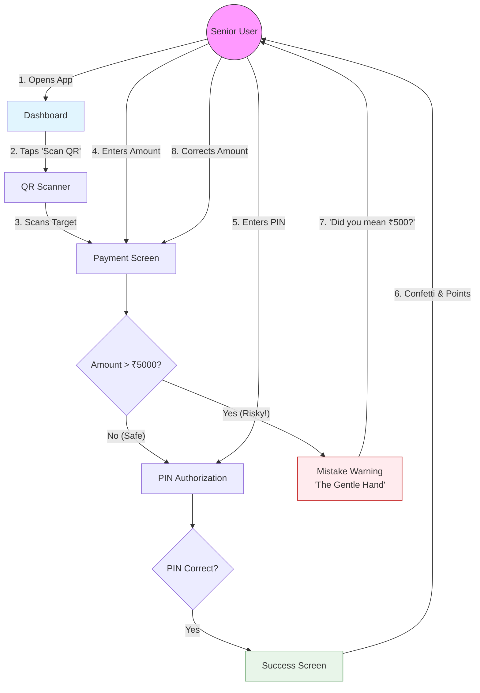
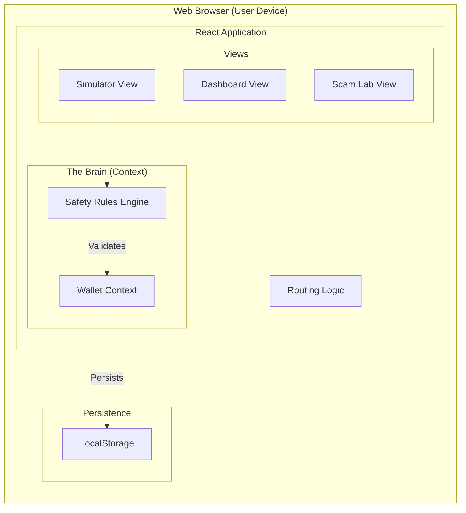

# System Architecture - SeniorSafe

## User Interaction Flow (The "How It Works")

This diagram illustrates how a user (the Senior) interacts with the system and how the application responds to those requests to build confidence.

## System Component Overview
Internal technical structure supporting the user flow.

